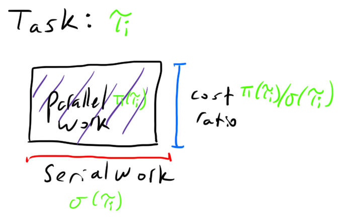

# serial or parallel scheduling problem

There are many problems for which the best parallel algorithms
have larger cost than the best serial algorithms, i.e. are not
work-efficient. We consider a scheduler that is receiving many
tasks with serial and parallel implementations that have
potentially different costs. The scheduler can choose whether to
run each task in serial or in parallel, and aims to either
minimize mean response time, or total awake time. 

